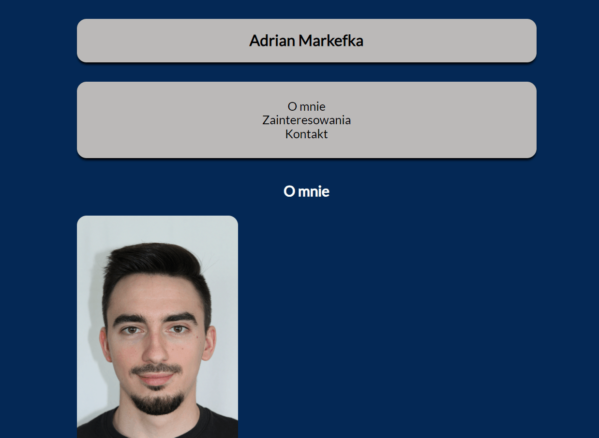

# Adrian Markefka Website

## Demo

https://am97veb.github.io/hompage/

## Description

Welcome to my first website, which tells briefly something about me: where I come from, where I studied and where I work. You will also find a section dedicated to my interests and my favorite music. The footer contains contact information.

I used Visual Studio Code, Cascading Style Sheet and BEM conventions to create my first site. I used JavaScript to change the background color using a button.

